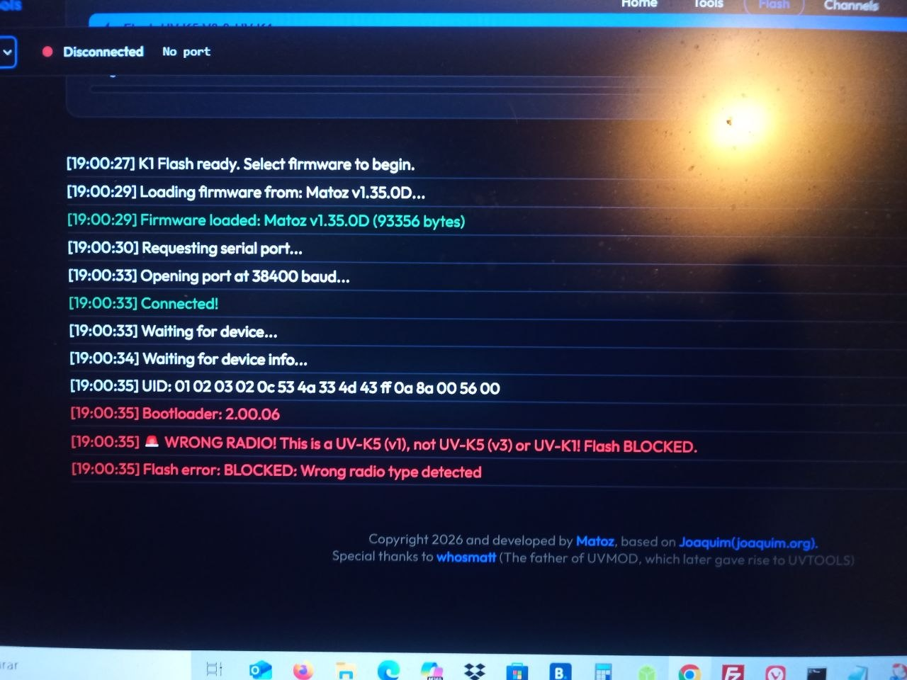

# Multi-UVTools

🌐 **[Aceder ao Site / Access the Website](https://spm81.github.io/Multi-UVTools/)**

  

---

## 🇵🇹 Português

Ferramenta web para flash de firmware em rádios Quansheng, TID, Radtel e outros diretamente no browser.

### ✨ Funcionalidades

- **Flash de Firmware** para UV-K5, UV-K6 e UV-5R Plus
- **Flash de Firmware** para UV-K5 V3 e UV-K1
- **Flash de Firmware** para TD-H3 e TD-H8
- **Flash de Firmware** para RT-880 e iRadio UV-98
- **Firmwares Stock** da Quansheng incluídos
- **Firmwares Custom** (Matoz, F4HWN, Calypso, Joaquim, Fagci e outros)
- **Leitura/Escrita de EEPROM**
- **Display Mirror** - Espelha o ecrã do rádio em tempo real
- **SMR** - Monitorização de sinal em tempo real
- **Spectrum Analyzer** - Analisador de espectro via UART (requer MCFW v1.35.1D)
- **Suporte para TK11, RT890, TD-H3/H8 e RT-880**
- Funciona diretamente no browser via **WebSerial API**
- Não requer instalação de software

### 📻 Rádios Suportados - Quansheng

| Modelo | Flash Firmware | EEPROM | Display Mirror | Spectrum |
|--------|----------------|--------|----------------|----------|
| UV-K5 | ✅ | ✅ | ✅ | ✅ |
| UV-K6 | ✅ | ✅ | ✅ | ✅ |
| UV-5R Plus | ✅ | ✅ | ✅ | ✅ |
| UV-K5 V3 | ✅ | ✅ | ✅ | ✅ |
| UV-K1 | ✅ | ✅ | ✅ | ✅ |

### 📻 Rádios Suportados - TK11 / RT890

| Modelo | Flash | SPI | Channels | Settings |
|--------|-------|-----|----------|----------|
| RT890 | ✅ | ✅ | - | - |
| TK11 | ❌ | - | ✅ | ✅ |

> ⚠️ **Nota:** O TK11 não suporta Flash... ainda.

### 📻 Rádios Suportados - TID TD-H3/H8

| Modelo | Flash | Channels | Band Plan | Codeplug |
|--------|-------|----------|-----------|----------|
| TD-H3 | ✅ | ✅ | ✅ | ✅ |
| TD-H8 | ✅ | ✅ | ✅ | ✅ |

### 📻 Rádios Suportados - Radtel RT-880 / iRadio UV-98

| Modelo | Flash | Monitor | SPI Backup |
|--------|-------|---------|------------|
| RT-880 | ✅ | ✅ | ✅ |
| iRadio UV-98 | ✅ | ✅ | ✅ |

### 🛡️ Proteção Anti-Brick (UV-K5)

O Multi-UVTools inclui proteção automática para evitar que rádios UV-K5 (originais) sejam flashados acidentalmente com firmware K1/K5v3:

  

**Bootloaders bloqueados na página K1 Flash:**
- `2.00.06` - UV-K5 original
- `5.00.01` e qualquer `5.xx.xx` - UV-K5 v2

Se detectado um destes bootloaders, o flash é **automaticamente bloqueado** para proteger o teu rádio!

### 📡 Spectrum Analyzer

O Spectrum Analyzer permite monitorizar o espectro de rádio em tempo real:

| Funcionalidade | Descrição |
|----------------|-----------|
| **5 Modos** | Spectrum, Channel, Scan, CTCSS/DCS, Blink |
| **70 Presets** | Bandas de rádio pré-configuradas |
| **CTCSS/DCS** | Detecção automática de tons |
| **Logging** | Registo de actividade com exportação |

> ⚠️ **Requisitos:** Firmware MCFW v1.35.1D e rádio em modo Spectrum (F+5)

### 🪞 Display Mirror - Compatibilidade

O Display Mirror suporta múltiplos perfis de firmware:

| Perfil | Firmwares Compatíveis | Baudrate |
|--------|----------------------|----------|
| **Joaquim UV-KX** | UV-KX Firmware (todas as versões) | 38400 / 115200 |
| **F4HWN UV-K5v1/v3 UV-K1** | F4HWN Custom Firmware (algumas versões) | 38400 / 115200 |

> 💡 **Nota:** O baudrate é flexível - seleciona o baudrate que corresponde à versão do teu firmware.

### ✉️ SMR - Compatibilidade

O SMR suporta os seguintes firmwares:

| Perfil | Firmwares Compatíveis |
|--------|----------------------|
| **Joaquim UV-KX** | UV-KX Firmware, MCFW V0.33.0C, MCFW V0.34.0C |

### 🚀 Como Usar

#### Flash UV-K5/K6/5R Plus
1. Acede a **[spm81.github.io/Multi-UVTools](https://spm81.github.io/Multi-UVTools/)**
2. Conecta o rádio em **modo boot** (pressiona PTT enquanto ligas)
3. Seleciona o firmware desejado
4. Clica em Flash!

#### Flash TD-H3/H8
1. Seleciona "📻 TD-H3/H8" no menu
2. Desliga o rádio
3. Pressiona **PTT + Power** para entrar em modo bootloader
4. Seleciona o firmware e clica Flash

#### Flash RT-880
1. Seleciona "📻 RT-880" no menu
2. Desliga o rádio
3. Pressiona **PTT + Power** para entrar em modo bootloader
4. Seleciona o firmware e clica Flash

### 📚 Documentação

- [Wiki Quansheng UV-K5 por Ludwich66](https://github.com/ludwich66/Quansheng_UV-K5_Wiki) - Documentação completa

---

## 🇬🇧 English

Web-based firmware flashing tool for Quansheng, TID, Radtel and other radios directly in your browser.

### ✨ Features

- **Firmware Flash** for UV-K5, UV-K6 and UV-5R Plus
- **Firmware Flash** for UV-K5 V3 and UV-K1
- **Firmware Flash** for TD-H3 and TD-H8
- **Firmware Flash** for RT-880 and iRadio UV-98
- **Stock Firmwares** from Quansheng included
- **Custom Firmwares** (Matoz, F4HWN, Calypso, Joaquim, Fagci and more)
- **EEPROM Read/Write**
- **Display Mirror** - Mirror the radio display in real time
- **SMR** - Signal monitoring in real time
- **Spectrum Analyzer** - Spectrum analyzer via UART (requires MCFW v1.35.1D)
- **Support for TK11, RT890, TD-H3/H8 and RT-880**
- Works directly in browser via **WebSerial API**
- No software installation required

### 📻 Supported Radios - Quansheng

| Model | Flash Firmware | EEPROM | Display Mirror | Spectrum |
|-------|----------------|--------|----------------|----------|
| UV-K5 | ✅ | ✅ | ✅ | ✅ |
| UV-K6 | ✅ | ✅ | ✅ | ✅ |
| UV-5R Plus | ✅ | ✅ | ✅ | ✅ |
| UV-K5 V3 | ✅ | ✅ | ✅ | ✅ |
| UV-K1 | ✅ | ✅ | ✅ | ✅ |

### 📻 Supported Radios - TK11 / RT890

| Model | Flash | SPI | Channels | Settings |
|-------|-------|-----|----------|----------|
| RT890 | ✅ | ✅ | - | - |
| TK11 | ❌ | - | ✅ | ✅ |

> ⚠️ **Note:** TK11 does not support Flash... yet

### 📻 Supported Radios - TID TD-H3/H8

| Model | Flash | Channels | Band Plan | Codeplug |
|-------|-------|----------|-----------|----------|
| TD-H3 | ✅ | ✅ | ✅ | ✅ |
| TD-H8 | ✅ | ✅ | ✅ | ✅ |

### 📻 Supported Radios - Radtel RT-880 / iRadio UV-98

| Model | Flash | Monitor | SPI Backup |
|-------|-------|---------|------------|
| RT-880 | ✅ | ✅ | ✅ |
| iRadio UV-98 | ✅ | ✅ | ✅ |

### 🛡️ Anti-Brick Protection (UV-K5)

Multi-UVTools includes automatic protection to prevent original UV-K5 radios from being accidentally flashed with K1/K5v3 firmware:

  

**Blocked bootloaders on K1 Flash page:**
- `2.00.06` - Original UV-K5
- `5.00.01` and any `5.xx.xx` - UV-K5 v2

If one of these bootloaders is detected, flash is **automatically blocked** to protect your radio!

### 📡 Spectrum Analyzer

The Spectrum Analyzer allows real-time radio spectrum monitoring:

| Feature | Description |
|---------|-------------|
| **5 Modes** | Spectrum, Channel, Scan, CTCSS/DCS, Blink |
| **70 Presets** | Pre-configured radio bands |
| **CTCSS/DCS** | Automatic tone detection |
| **Logging** | Activity logging with export |

> ⚠️ **Requirements:** MCFW v1.35.1D firmware and radio in Spectrum mode (F+5)

### 🪞 Display Mirror - Compatibility

The Display Mirror supports multiple firmware profiles:

| Profile | Compatible Firmwares | Baudrate |
|---------|---------------------|----------|
| **Joaquim UV-KX** | UV-KX Firmware (all versions) | 38400 / 115200 |
| **F4HWN UV-K5v1/v3 UV-K1** | F4HWN Custom Firmware (some versions) | 38400 / 115200 |

> 💡 **Note:** Baudrate is flexible - select the baudrate that matches your firmware version.

### ✉️ SMR - Compatibility

The SMR supports the following firmwares:

| Profile | Compatible Firmwares |
|---------|---------------------|
| **Joaquim UV-KX** | UV-KX Firmware, MCFW V0.33.0C, MCFW V0.34.0C |

### 🚀 How to Use

#### Flash UV-K5/K6/5R Plus
1. Go to **[spm81.github.io/Multi-UVTools](https://spm81.github.io/Multi-UVTools/)**
2. Connect the radio in **boot mode** (hold PTT while turning on)
3. Select the desired firmware
4. Click Flash!

#### Flash TD-H3/H8
1. Select "📻 TD-H3/H8" from the menu
2. Turn off the radio
3. Press **PTT + Power** to enter bootloader mode
4. Select firmware and click Flash

#### Flash RT-880
1. Select "📻 RT-880" from the menu
2. Turn off the radio
3. Press **PTT + Power** to enter bootloader mode
4. Select firmware and click Flash

### 📚 Documentation

- [Quansheng UV-K5 Wiki by Ludwich66](https://github.com/ludwich66/Quansheng_UV-K5_Wiki) - Complete documentation

---

## 🤝 Contribuir / Contributing

Este projeto é open source! Podes contribuir com:
- Pull requests
- Reportar bugs
- Sugerir novos firmwares
- Adicionar o teu firmware personalizado

This project is open source! You can contribute by:
- Pull requests
- Reporting bugs
- Suggesting new firmwares
- Add your custom firmware

---

## 📄 Licença / License

Open Source - Feel free to use and contribute!

---

Made with ❤️ by [spm81](https://github.com/spm81) (Matoz)
